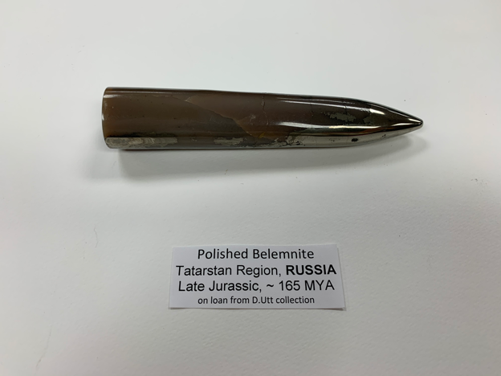
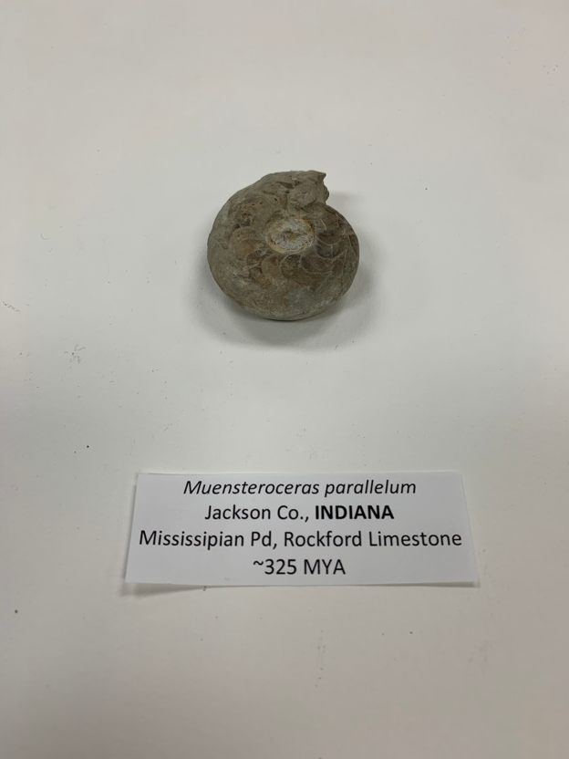
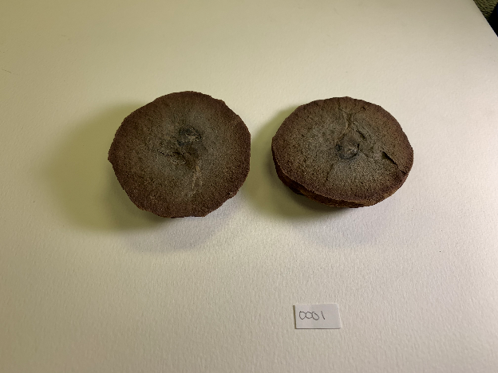

 Our Original Database:
 https://github.com/Kristin35/ComputingIIProject
 
 #Below is our data frame which contains all available information about the Ammonite and Mazon Creek Fossils that Dr. Utt wanted us to input. 
 #The data frame outputs to an HTML table with various categories including a name with a five letter and four digit code that references each fossil and will be used later to reference pictures of each fossil. 

```{r echo=FALSE}
FossilDatabase <- data.frame("Fossil_Type" = c("Ammonites", "", "", "", "", "", "", "", "", "", "", "", "", "", "", "", "", "", "", "Mazon_Creek", "", "", "", "", "", "", "", "", "", "", "", "", "", "", "", "", "", "", "", "", "", "", "", "", "", "", "", "", "", "", "", "", "", "", "", "", ""), 
                              "Name" = c("", "MOLAM0001", "MOLAM0002", "MOLAM0003", "MOLAM0004", "MOLAM0005", "MOLAM0006", "MOLAM0007", "MOLAM0008", "MOLAM0009", "MOLAM0010", "MOLAM0011", "MOLAM0012", "MOLAM0013", "MOLAM0014", "MOLAM0015", "MOLAM0016", "MOLAM0017", "MOLAM0018", "", "MAZCRK0001", "MAZCRK0002", "MAZCRK0003", "MAZCRK0004", "MAZCRK0005", "MAZCRK0006", "MAZCRK0007", "MAZCRK0008", "MAZCRK0009", "MAZCRK0010", "MAZCRK0011", "MAZCRK0012", "MAZCRK0013", "MAZCRK0014", "MAZCRK0015", "MAZCRK0016", "MAZCRK0017", "MAZCRK0018", "MAZCRK0019", "MAZCRK0020", "MAZCRK0021", "MAZCRK0022", "MAZCRK0023", "MAZCRK0024", "MAZCRK0025", "MAZCRK0026", "MAZCRK0027", "MAZCRK0028", "MAZCRK0029", "MAZCRK0030", "MAZCRK0031", "MAZCRK0032", "MAZCRK0033", "MAZCRK0034", "MAZCRK0035", "MAZCRK0036", "MAZCRK0037"),
                              "Genus" = c("", "Graspedites", "N/A", "Polished Belemnite", "Eleganticeras", "Metalegoceras", "N/A", "Hypocladiscites", "N/A", "Lanceolites", "54", "Tissotia", "Microdoceras", "Laevaptychus", "N/A", "N/A", "Muensteroceras", "N/A", "N/A", "", "N/A", "N/A", "N/A", "N/A", "N/A", "N/A", "N/A", "N/A", "N/A", "N/A", "N/A", "N/A", "N/A", "N/A", "N/A", "N/A", "N/A", "N/A", "N/A", "N/A", "N/A", "N/A", "N/A", "N/A", "N/A", "N/A", "N/A", "N/A", "N/A", "N/A", "N/A", "N/A", "N/A", "N/A", "N/A", "N/A", "N/A"),
                              "Species" = c("", "N/A", "N/A", "N/A", "elegantulum", "tschernyschewi", "N/A", "subaratus plantus", "N/A", "compactus", "N/A", "obesa", "N/A", "latus", "N/A", "N/A", "parallelum", "N/A", "N/A", "", "N/A", "N/A", "N/A", "N/A", "N/A", "N/A", "N/A", "N/A", "N/A", "N/A", "N/A", "N/A", "N/A", "N/A", "N/A", "N/A", "N/A", "N/A", "N/A", "N/A", "N/A", "N/A", "N/A", "N/A", "N/A", "N/A", "N/A", "N/A", "N/A", "N/A", "N/A", "N/A", "N/A", "N/A", "N/A", "N/A", "N/A"),
                              "Country" = c("", "Russia", "Nepal", "Russia", "England", "Indonesia", "United Kingdom", "Indonesia", "USA", "Indonesia", "Morocco", "Peru", "United Kingdom", "England", "United Kingdom", "USA", "USA", "United Kingdom", "Morocco", "", "USA", "USA", "USA", "USA", "USA", "USA", "USA", "USA", "USA", "USA", "USA", "USA", "USA", "USA", "USA", "USA", "USA", "USA", "USA", "USA", "USA", "USA", "USA", "USA", "USA", "USA", "USA", "USA", "USA", "USA", "USA", "USA", "USA", "USA", "USA", "USA", "USA"),
                              "State_or_Region" = c("", "N/A", "Annapurna, Mustang", "Tarstan Region", "North Yorkshire, Whitby Cannonball", "Timor, Noe Bihati", "Charmouth", "Timor, Noe Bihati", "Wyoming", "Timor, Noe Bihati", "N/A", "Cajamarca", "Black Ven, Lyme Regis", "Westbury, Wiltshire", "North Yorkshire, Nr. Whitby Kettleness", "Little Glasses Creek, Marshall County, Little Glasses Creek, Oklahoma", "Jackson County, Indiana", "Charmouth", "N/A", "", "Illinois", "Illinois", "Illinois", "Illinois", "Illinois", "Illinois", "Illinois", "Illinois", "Illinois", "Illinois", "Illinois", "Illinois", "Illinois", "Illinois", "Illinois", "Illinois", "Illinois", "Illinois", "Illinois", "Illinois", "Illinois", "Illinois", "Illinois", "Illinois", "Illinois", "Illinois", "Illinois", "Illinois", "Illinois", "Illinois", "Illinois", "Illinois", "Illinois", "Illinois", "Illinois", "Illinois", "Illinois"),
                              "Formation" = c("", "N/A","N/A","N/A","N/A","N/A", "N/A","N/A","N/A","N/A","N/A", "N/A","N/A","N/A","N/A", "N/A", "Rockford Limestone", "N/A", "N/A", "", "Mazon Creek", "Mazon Creek", "Mazon Creek", "Mazon Creek", "Mazon Creek", "Mazon Creek", "Mazon Creek", "Mazon Creek", "Mazon Creek", "Mazon Creek", "Mazon Creek", "Mazon Creek", "Mazon Creek", "Mazon Creek", "Mazon Creek", "Mazon Creek", "Mazon Creek", "Mazon Creek", "Mazon Creek", "Mazon Creek", "Mazon Creek", "Mazon Creek", "Mazon Creek", "Mazon Creek", "Mazon Creek", "Mazon Creek", "Mazon Creek", "Mazon Creek", "Mazon Creek", "Mazon Creek", "Mazon Creek", "Mazon Creek", "Mazon Creek", "Mazon Creek", "Mazon Creek", "Mazon Creek", "Mazon Creek"),
                              "Time_Period" = c("", "Jurassic", "Jurassic", "Late Jurassic", "Lower Jurassic", "Lower Permian", "N/A", "Norian, Triassic", "N/A", "Lower Triassic Smithian", "N/A", "Upper Cretaceous Coniacian", "N/A", "Kimmeridgian Jurassic", "Bifrons Zone, Commune Subzone, Upper Lias, Lower Jurassic", "N/A", "N/A", "N/A", "N/A", "", "N/A", "N/A", "N/A", "N/A", "N/A", "N/A", "N/A", "N/A", "N/A", "N/A", "N/A", "N/A", "N/A", "N/A", "N/A", "N/A", "N/A", "N/A", "N/A", "N/A", "N/A", "N/A", "N/A", "N/A", "N/A", "N/A", "N/A", "N/A", "N/A", "N/A", "N/A", "N/A", "N/A", "N/A", "N/A", "N/A", "N/A"),
                              "Dates" = c("", "N/A", "~185 MYA", "165 MYA", "180 MYA", "N/A", "N/A", "227-208.5 MYA", "N/A", "N/A", "N/A", "N/A", "N/A", "157 MYA", "180 MYA", "N/A", "325 MYA", "N/A", "N/A", "", "N/A", "N/A", "N/A", "N/A", "N/A", "N/A", "N/A", "N/A", "N/A", "N/A", "N/A", "N/A", "N/A", "N/A", "N/A", "N/A", "N/A", "N/A", "N/A", "N/A", "N/A", "N/A", "N/A", "N/A", "N/A", "N/A", "N/A", "N/A", "N/A", "N/A", "N/A", "N/A", "N/A", "N/A", "N/A", "N/A", "N/A"),
                              "Value" = c("", "N/A","N/A","N/A","N/A","N/A", "N/A", "N/A", "N/A", "N/A", "N/A", "N/A", "N/A", "N/A", "N/A", "N/A", "N/A", "N/A", "N/A", "", "N/A", "N/A", "N/A", "N/A", "N/A", "N/A", "N/A", "N/A", "N/A", "N/A", "N/A", "N/A", "N/A", "N/A", "N/A", "N/A", "N/A", "N/A", "N/A", "N/A", "N/A", "N/A", "N/A", "N/A", "N/A", "N/A", "N/A", "N/A", "N/A", "N/A", "N/A", "N/A", "N/A", "N/A", "N/A", "N/A", "N/A"),
                              "Collector" = c("", "R. Unzha Kostroma", "N/A", "Dr. Utt", "N/A", "N/A", "N/A", "N/A", "N/A", "N/A", "N/A", "N/A", "N/A", "N. Zachariades", "N/A", "Dr. Utt", "N/A", "N/A", "N/A", "", "N/A", "N/A", "N/A", "N/A", "N/A", "N/A", "N/A", "N/A", "N/A", "N/A", "N/A", "N/A", "N/A", "N/A", "N/A", "N/A", "N/A", "N/A", "N/A", "N/A", "N/A", "N/A", "N/A", "N/A", "N/A", "N/A", "N/A", "N/A", "N/A", "N/A", "N/A", "N/A", "N/A", "N/A", "N/A", "N/A", "N/A"),
                              "Common_Name" = c("", "N/A", "Shaligram", "polished Belemite", "N/A", "N/A", "N/A", "N/A", "Belemite Guard", "N/A", "Goniatite", "N/A", "N/A", "N/A", "Whitby Snakestone", "N/A", "N/A", "N/A", "Goniatite", "", "N/A", "N/A", "N/A", "N/A", "N/A", "N/A", "N/A", "N/A", "N/A", "N/A", "N/A", "N/A", "N/A", "N/A", "N/A", "N/A", "N/A", "N/A", "N/A", "N/A", "N/A", "N/A", "N/A", "N/A", "N/A", "N/A", "N/A", "N/A", "N/A", "N/A", "N/A", "N/A", "N/A", "N/A", "N/A", "N/A", "N/A"),
                              "Descriptor" = c("", "N/A","N/A","N/A","N/A","N/A", "N/A", "Mojsisovics", "N/A", "N/A", "N/A", "N/A", "N/A", "Parkinson", "N/A", "N/A", "N/A", "N/A", "N/A", "", "N/A", "N/A", "N/A", "N/A", "N/A", "N/A", "N/A", "N/A", "N/A", "N/A", "N/A", "N/A", "N/A", "N/A", "N/A", "N/A", "N/A", "N/A", "N/A", "N/A", "N/A", "N/A", "N/A", "N/A", "N/A", "N/A", "N/A", "N/A", "N/A", "N/A", "N/A", "N/A", "N/A", "N/A", "N/A", "N/A", "N/A"),
                              "Miscellaneous" = c("", "N/A", "Kali_Gandaki_River", "N/A", "polished upper lias, falciferum subzone", "N/A", "Belemite", "N/A", "N/A", "N/A", "N/A", "N/A", "N/A", "aptychii: paired calcereous plates forming part of the jaw apparatus in certain ammonite families", "N/A", "Rhynocholites", "Mississippian Pd", "Pyritized", "N/A", "", "N/A", "N/A", "N/A", "N/A", "N/A", "N/A", "N/A", "N/A", "N/A", "N/A", "N/A", "N/A", "N/A", "N/A", "N/A", "N/A", "N/A", "N/A", "N/A", "N/A", "N/A", "N/A", "N/A", "N/A", "N/A", "N/A", "N/A", "N/A", "N/A", "N/A", "N/A", "N/A", "N/A", "N/A", "N/A", "N/A", "N/A"),
                              "Images" = c("", "MOLAM0001", "MOLAM0002", "MOLAM0003", "MOLAM0004", "MOLAM0005", "MOLAM0006", "MOLAM0007", "MOLAM0008", "MOLAM0009", "MOLAM00010", "MOLAM00011", "MOLAM00012", "MOLAM00013", "MOLAM00014", "MOLAM00015", "MOLAM00016", "MOLAM00017", "MOLAM00018", "", "MAZCRK0001", "MAZCRK0002", "MAZCRK0003", "MAZCRK0004", "MAZCRK0005", "MAZCRK0006", "MAZCRK0007", "MAZCRK0008", "MAZCRK0009", "MAZCRK0010", "MAZCRK0011", "MAZCRK0012", "MAZCRK0013", "MAZCRK0014", "MAZCRK0015", "MAZCRK0016", "MAZCRK0017", "MAZCRK0018", "MAZCRK0019", "MAZCRK0020", "MAZCRK0021", "MAZCRK0022", "MAZCRK0023", "MAZCRK0024", "MAZCRK0025", "MAZCRK0026", "MAZCRK0027", "MAZCRK0028", "MAZCRK0029", "MAZCRK0030", "MAZCRK0031", "MAZCRK0032", "MAZCRK0033", "MAZCRK0034", "MAZCRK0035", "MAZCRK0036", "MAZCRK0037"))
```

#The code below allows for a photo of each fossil to be output into the HTML file by drawing from the saved png file in the ComputingIIProjectII file.
#Each photo is knit with the five letter four digit code that references the name in the table. 

```{r echo=FALSE}
library(knitr)
fossils <- FossilDatabase
kable(fossils[1:45, ], caption = "Database of the Ammonites and the Mazon Creek Fossils")
```

 





 


 







